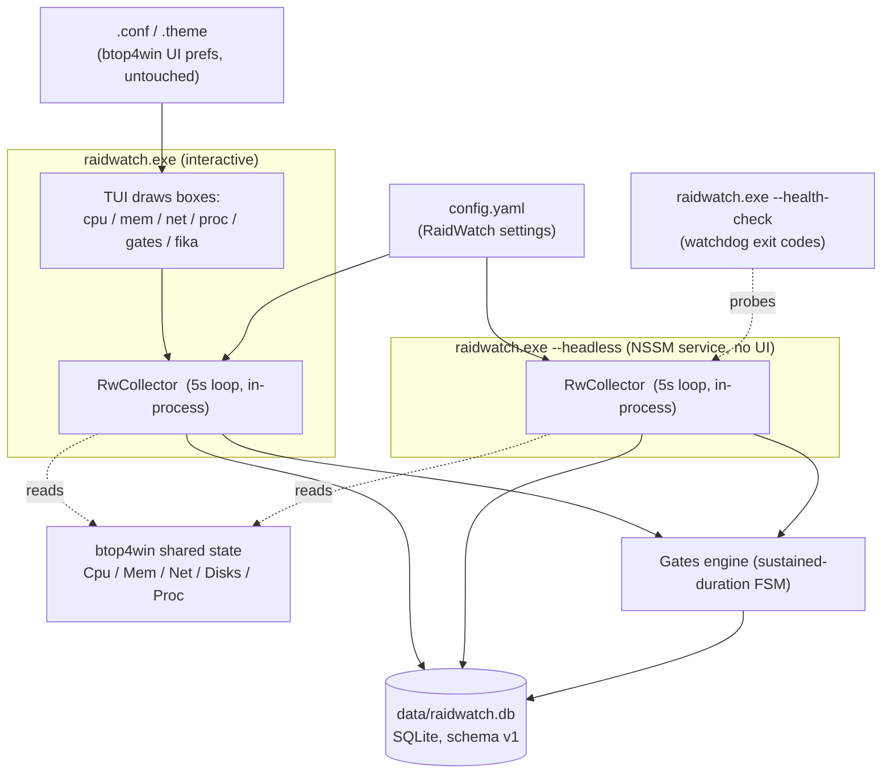

# RaidWatch → btop4win C++ TUI Migration

RaidWatch is migrating from a Python/FastAPI browser-served web dashboard to a
C++ TUI built by forking **btop4win** (C++20, Apache-2.0). This folder is the
executable migration plan: one board (this README) plus one self-contained spec
file per step (`01-*.md` … `10-*.md`). The migration runs as a **WIP=1 Kanban
workflow** — exactly one step is In Progress at any time, steps run in numeric
order, and nothing is called Done until its Definition-of-Done is checked and a
Log entry records the verification evidence.

RaidWatch's unique features — upgrade gates, the Fika context module, WHEA event
collection, SQLite persistence, and headless service mode — are ported into the
fork; the entire Python web stack is removed in the final step. Every
load-bearing decision is recorded in the [Decision table](#decision-table)
below (IDs `T1`–`T13`); every Python module's destination is in the
[Python → C++ module map](#python--c-module-map).

---

## WIP=1 workflow rules

1. **One `Status:` line per step file.** Each step file carries
   `Status: Backlog | In Progress | Blocked | Done` near the top.
2. **Pull exactly ONE step** from `Backlog` → `In Progress`. Two steps In
   Progress at the same time is a process violation — fix the board before doing
   any further work.
3. **Steps execute in numeric order** (01 → 10). Dependencies are linear by
   design; do not start step *N+1* until step *N* is `Done`.
4. **`Done` requires both:** every `Definition of Done` checkbox in the step
   file is checked **AND** a `## Log` entry at the file bottom records the date
   plus the verification evidence (commands run + observed output).
5. **A `Blocked` step KEEPS the WIP slot.** Note the blocker in both the step
   file and the board table below; do **not** start the next step unless the
   user explicitly re-plans around the blocker.
6. **Status changes commit with the work they describe.** Flip a status line in
   the same commit/PR as the code or docs that earned it.

### Status table

| Step | Title | Status |
| --- | --- | --- |
| [01](01-fork-build-baseline.md) | Fork, build & baseline btop4win | Done |
| [02](02-config-storage-foundation.md) | Config + storage foundation | Backlog |
| [03](03-collector-persistence.md) | Collector & persistence | Backlog |
| [04](04-whea-advanced-counters.md) | WHEA + advanced PerfMon counters | Backlog |
| [05](05-lhm-temps.md) | LHM temperatures | Backlog |
| [06](06-fika-module.md) | Fika module | Backlog |
| [07](07-gates-engine.md) | Gates engine | Backlog |
| [08](08-tui-panels-theming.md) | TUI panels & theming | Backlog |
| [09](09-headless-service.md) | Headless & service mode | Backlog |
| [10](10-cutover-python-removal.md) | Cutover — Python removal | Backlog |

---

## Target architecture



`raidwatch.exe` is the btop4win fork. In **TUI mode** it draws the boxes
(cpu/mem/net/proc plus the new `gates` and `fika` boxes) and runs `RwCollector`
in-process. In **`--headless` mode** it runs the collector, gates engine, and
SQLite persistence with no UI, installed as an NSSM service. Gates advance in
both modes; history is shared through the SQLite database at
`data/raidwatch.db` (the v1 schema, ported exactly — see T5). RaidWatch settings
live in `config.yaml`; UI preferences stay in btop4win's own `.conf` / `.theme`
mechanism (untouched).

---

## Decision table

These are the load-bearing decisions for the migration. They are fixed; step
files reference them by ID and must not re-litigate them. Where a decision names
a `DNN` reference, that points at a decision in the (gitignored)
`.docs/DECISIONS.md` of the legacy Python project — the semantics carry over to
the C++ port.

| ID | Decision |
| --- | --- |
| **T1 — Vendoring** | btop4win is vendored at pinned upstream commit `4b4bda273988e7eec41727a41f2cbc907d14eb0e` (master, 2025-10-12, v1.0.5) into `native/btop4win/` as a full source copy (no submodule). Apache-2.0 `LICENSE` kept in that folder + a `NOTICE` attribution at the repo root. Upstream is near-dormant; the fork is effectively standalone; sync is manual. |
| **T2 — Build** | Keep upstream MSBuild (`btop4win.sln` / `btop4win.vcxproj`, C++20). No CMake. New RaidWatch code lives in new translation units under `native/btop4win/src/raidwatch/` added to the vcxproj, keeping upstream files minimally touched. Build machine: Windows 10/11 + MSVC Build Tools 2022 + Windows SDK + git. The Linux dev box cannot build or run C++ steps — those execute on the Windows host (the 1800X box or any Windows dev machine). |
| **T3 — Runtime modes** | Single binary. `raidwatch.exe` = TUI + in-process collector. `raidwatch.exe --headless` = collector + gates + persistence, no UI (NSSM service). Gates advance in both modes; history is shared via the DB. |
| **T4 — Config** | Two-layer. UI prefs stay in btop4win's `.conf` mechanism (untouched). RaidWatch settings keep the existing `config.yaml` schema **minus** the `server:` and `auth:` sections (both dropped — the local TUI has no HTTP surface; auth is not ported). Parsed with the vendored rapidyaml single header (`native/third_party/ryml_all.hpp`). First-run auto-generation from `config.yaml.example` preserved (D23). Unknown keys warn-and-ignore (no hard failure). |
| **T5 — Storage** | SQLite official amalgamation vendored at `native/third_party/sqlite3.c`. Port schema v1 exactly (tables `metrics_history`, `fika_events`, `gate_events`, `whea_events` + their indexes) and the `PRAGMA user_version` migration pattern from `raidwatch/database.py`. Single connection serialized on the collector thread (D21 analog). Query-time downsampling `GROUP BY (ts / bucket)` with `max()` for peaks / `avg()` for rates (D15). UTC epoch ms everywhere (D19). |
| **T6 — Collector** | New `RwCollector` (5s loop, whole body wrapped in try/catch, per-module isolation with error counters, backoff to ~60s after 5 consecutive failures — D8/D27 analogs; `std::chrono::steady_clock` for all durations — D19 analog). It reads btop4win's ALREADY-collected shared state (Cpu/Mem/Net/Disks/Proc) — do **not** port the psutil code paths; btop4win's `btop_collect.cpp` already gathers equivalents via PDH/WMI/Psapi. New C++ collection code only for what btop4win lacks: WHEA, PDH extras, Fika, gates (T7–T9). |
| **T7 — WHEA** | Port `raidwatch/modules/system.py::_query_whea_events` (System log, provider `Microsoft-Windows-WHEA-Logger`, 2h window, dedupe by event record number) to wevtapi (`EvtQuery` XPath + `EvtRender` XML). 60s poll cadence with cached count between polls (D16). |
| **T8 — Temps** | Use btop4win's existing `LHM_Enabled` build configuration with the LHM-CppExport `CPPdll.dll` (source: github.com/aristocratos/LHM-CppExport), **not** the pythonnet path. Add `temps.tctl_offset` (default `20.0`) to `config.yaml` for Zen1 Tctl correction, applied when reading the CPU package sensor. Persist `cpu_temp_c` in `metrics_history`. Version-skew rule: ship the LHM DLL set matched to CPPdll (btop4win v1.0.5 ships LHM 0.9.4); do **not** mix with the repo's pythonnet LHM 0.9.6 DLLs. Fallback if CPPdll cannot be built/obtained: temps degrade to NULL (D8) and the `cpu_thermal` gate stays disarmed; the step documents this, it is **not** a blocker for later steps. |
| **T9 — Gates** | Port `raidwatch/gates.py` 1:1 — sustained-duration state machine, `HYSTERESIS_FACTOR = 0.9`, `COOLDOWN_SECONDS = 1800`, operator set `{>, <, >=, <=, ==, !=}`, `storage_space` default operator `<`, `GATE_METRIC_MAP` becomes C++ accessors over the RwSnapshot struct. Persist `gate_events`. `compute_status_pill` precedence (stale > High gate > Medium gate > Operational) drives a TUI header pill. Timing tests ported to catch2. |
| **T10 — UI** | New `gates` and `fika` boxes implemented in upstream draw style as new file `src/raidwatch/rw_draw.cpp`; extend `shown_boxes` config values with `gates fika`; WHEA 2h count as a badge on the cpu box; status pill in the header; CSV export via a TUI key and `raidwatch.exe --export-csv <path>`; ship a RaidWatch `.theme` file. Process filter/sort/tree/details/terminate, menus, mouse, presets, and btop `.theme` support come free from upstream — **verify only, do not port**. Windows-services control and battery: upstream features left as-is, zero new work. |
| **T11 — Tests** | Vendor catch2 v2.13.10 single header (`native/third_party/catch.hpp`); new `native/tests/` + `rw_tests` project in the solution. Port these Python suites: `test_gate_timing.py` → gates state machine; `test_log_regex.py` → fika log parsing; `test_downsampling.py` → downsampling SQL; `test_config_validation.py` → RwConfig; WHEA window/dedupe logic. The Python pytest suite stays green until step 10. |
| **T12 — Service/ops** | Port `scripts/install_service.ps1` / `uninstall_service.ps1` and the watchdog Scheduled Task to the new binary. Replace the HTTP `/health` watchdog probe with `raidwatch.exe --health-check` (exit 0 ok / 1 stale / 2 error — D35 analog without HTTP; staleness = collector hasn't ticked in >3 cycles ≈ 15s). NSSM restart-on-exit covers process crashes (D27 analog); the collector loop body is fully wrapped so the loop cannot die. |
| **T13 — Cutover** | Final step deletes the entire Python web stack: `raidwatch/` package, `tests/`, `templates/`, `static/`, `pyproject.toml`, `uv.lock`, Python-only scripts (`collect_once.py`, `smoke_test_m2/m3.py`, `stress_test_sim.py` — ported to C++ equivalents where still needed), and the FastAPI/SSE/Jinja/Chart.js dependency set. `README` and `AGENTS.md` are rewritten for the C++ project. The 48h soak is the final gate. |

---

## Python → C++ module map

Each row is the Python source on the left and its C++ destination on the right.
"NOT ported" rows are deleted in [step 10](10-cutover-python-removal.md).

| Python source | C++ destination |
| --- | --- |
| `raidwatch/config.py` (minus `server`/`auth`) | `src/raidwatch/rw_config.cpp` (+ ryml) |
| `raidwatch/database.py` | `src/raidwatch/rw_database.cpp` (+ sqlite3 amalgamation) |
| `raidwatch/collector.py` | `src/raidwatch/rw_collector.cpp` (reads btop4win state) |
| `modules/system.py` psutil parts | **NOT ported** (upstream `btop_collect.cpp` covers) |
| `modules/system.py` WHEA + win32pdh parts | `src/raidwatch/rw_whea.cpp`; PDH extras in `rw_collector.cpp` |
| `modules/temps.py` | upstream `LHM_Enabled` path + offset handling in `rw_collector.cpp` |
| `modules/fika.py` | `src/raidwatch/rw_fika.cpp` |
| `raidwatch/gates.py` | `src/raidwatch/rw_gates.cpp` |
| `raidwatch/health.py` | `--health-check` in `src/raidwatch/rw_headless.cpp` |
| `raidwatch/main.py` REST/SSE | **NOT ported**; CSV export → `rw_database.cpp` + CLI flag |
| `raidwatch/auth.py`, `broker.py`, `supervisor.py`, `templates/`, `static/` | **NOT ported** (deleted in step 10; `supervisor`/`broker` have NSSM + in-process analogs) |

---

## Dev prerequisites

From T2: C++ build/run happens **only on Windows**. A Windows 10/11 machine
with **MSVC Build Tools 2022**, the **Windows SDK**, and **git** is required
for steps 01–10. The Linux dev box is **docs/planning only** during the
migration — it can author and review the docs in this folder but cannot build or
run `raidwatch.exe`.

> **Operational host-access notes** — SSH to the build host, the elevation
> "sudo" trick, and the C++ build gotchas learned in step 01 live in
> `.docs/HANDOFF.md` (gitignored, local). Read it before driving the host.

The **Python suite stays the source of truth for legacy behavior** until step 10
deletes it. Until then:

```bash
uv run pytest            # legacy Python tests stay green
uv run ruff check .      # legacy lint stays clean
```

These commands guard the legacy code that the C++ ports are validated against;
they are run on the Linux box between C++ steps to catch regressions in any
legacy file still being referenced.

---

## Step file template

Every step file (`01-*.md` … `10-*.md`) follows this exact skeleton:

```markdown
# NN — Title

Status: Backlog

## Goal
<One short paragraph: what this step delivers and why it sits here in the order.>

## Requires
<The prior step numbers that must be Done before this one starts.>

## Tasks
<An ordered, concrete checklist. Each item is a single actionable unit.>

## Files
<Created / modified paths, grouped by Created and Modified.>

## Definition of Done
- [ ] <observable criterion — every checkbox must be checkable from evidence>

## Verification
<Commands + the expected output that proves the DoD.>

## Log
<Empty until the step is executed. On Done: date + verification evidence.>
```

A step is `Done` only when every `Definition of Done` checkbox is checked **and**
the `## Log` section records the date and the verification evidence (rule 4
above).
